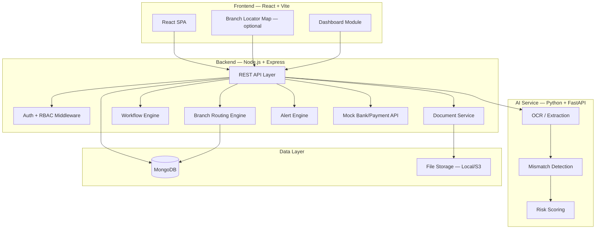
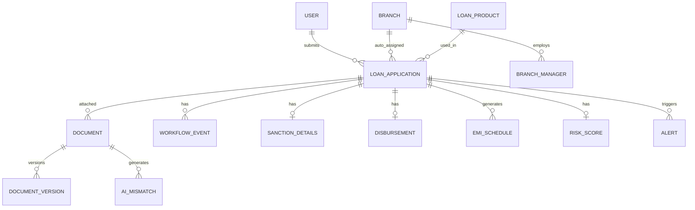
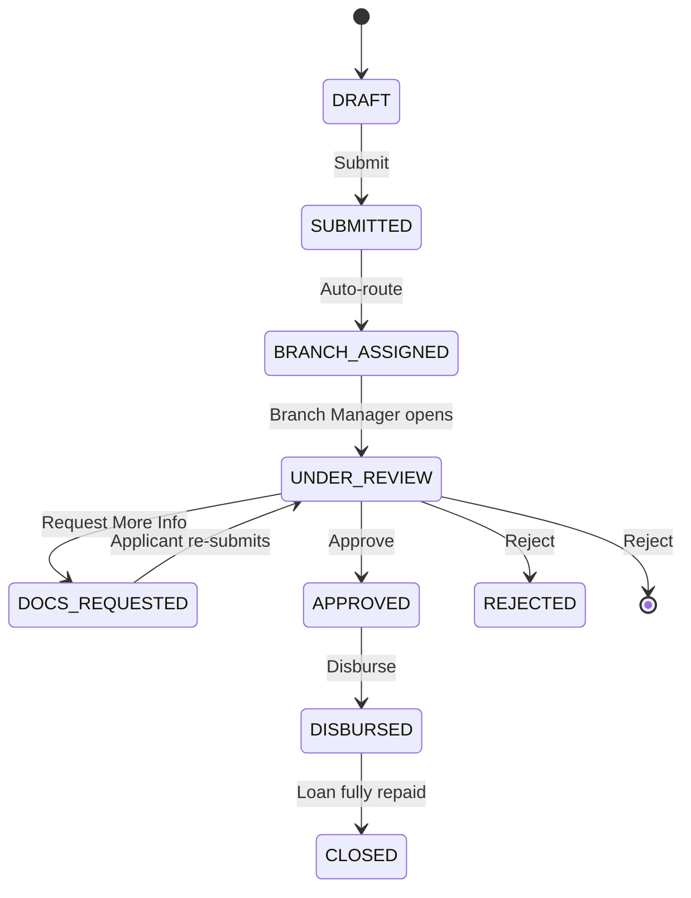
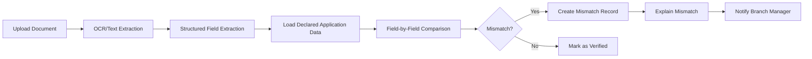

# Phase 0 — Project Analysis & Architecture

## FinSure Solutions Pvt Ltd — Loan Origination & Management Platform

---

## Repository Status

The repository is assumed **empty or early-stage** — containing only the PRD.md, Build Phases document, Master Build Blueprint, README.md and SETUP.md generated so far. All application code will be built from scratch, phase by phase.

---

## A. Product Architecture

The system is a **modular monolith** with a separate AI microservice. This is the right balance for a prototype — clean separation of concerns without microservice overhead.



### Module Relationships

| Module | Depends On | Provides To |
|--------|-----------|-------------|
| Auth & RBAC | Database | All modules (middleware) |
| Branch Management | Auth | Branch Routing, Dashboard |
| Loan Product Management | Auth | Applications, Dashboard |
| Loan Application | Auth, Loan Products | Branch Routing, Workflow, Dashboard |
| Branch Routing | Branches, Applications | Workflow (queue visibility) |
| Workflow Engine | Applications, Branches, Auth | Alerts, Audit |
| Document Management | Applications | AI Pipeline, Audit |
| AI Pipeline | Documents, Applications | Mismatch alerts, Risk scores |
| Sanction & Disbursement | Applications, Workflow | Dashboard, Alerts, EMI |
| EMI / Repayment | Sanction & Disbursement | Dashboard, Alerts |
| Dashboard | All data modules | Admin views |
| Alerts & Escalation | Workflow, Deadlines, EMI | Notifications |
| Mock Bank/Payment API | Disbursement | Sync verification data |

---

## B. User Roles

| Role | Key | Permissions |
|------|-----|-------------|
| **Applicant / User** | `USER` | Apply for loans, upload documents, track own applications, view own EMI schedule |
| **Branch Manager** | `BRANCH_MANAGER` | Review branch queue, verify documents, approve/reject/request docs, generate sanction letters, update disbursement |
| **System Admin** | `ADMIN` | Branch & loan product management, platform-wide oversight, dashboards, audit trail, system configuration |

### Permission Matrix

| Resource | USER | BRANCH_MANAGER | ADMIN |
|----------|------|-----------------|-------|
| Loan Products — Create/Edit | ✗ | ✗ | ✓ |
| Loan Products — View | ✓ | ✓ | ✓ |
| Applications — Create | ✓ | ✗ | ✗ |
| Applications — View | Own | Own Branch | All |
| Applications — Reassign Branch | ✗ | ✗ | ✓ |
| Documents — Upload | Own | ✗ | ✗ |
| Documents — Verify | ✗ | Own Branch | View Only |
| Workflow — Approve/Reject | ✗ | Own Branch | View Only |
| Sanction Letter — Generate | ✗ | Own Branch | View Only |
| Disbursement — Update | ✗ | Own Branch | View Only |
| EMI Schedule — View | Own | Own Branch | All |
| Branches — CRUD | ✗ | ✗ | ✓ |
| Branch Managers — Create | ✗ | ✗ | ✓ |
| Dashboard — Platform-wide | ✗ | ✗ | ✓ |
| Dashboard — Branch-level | ✗ | Own Branch | ✓ |
| Alerts — Manage | ✗ | Own Branch | ✓ |
| Audit Trail | ✗ | Own Branch | ✓ |

---

## C. Frontend Routes / Pages

```
/                              → Redirect to /dashboard or /login
/login                         → Login page
/register                      → User self-registration
/dashboard                     → Role-based dashboard (User/Branch/Admin)
/loan-products                 → Loan product catalog
/apply                         → New loan application (multi-step form)
/applications                  → Application list (own / branch queue / all — role-based)
/applications/:id               → Application detail
/applications/:id/documents      → Documents for an application
/applications/:id/workflow       → Workflow / status timeline
/applications/:id/sanction       → Sanction letter view
/applications/:id/disbursement   → Disbursement status
/applications/:id/emi            → EMI schedule for the application
/branches                       → Branch list (Admin)
/branches/new                   → Create branch (Admin only)
/branches/:id                   → Branch detail + performance
/branch-managers                → Branch Manager accounts (Admin)
/documents                      → Document management (role-scoped)
/documents/:id                  → Document detail + preview
/ai/mismatch                    → AI mismatch detection results
/alerts                         → Alerts & escalation
/audit                          → Audit trail (Admin/Branch Manager)
/profile                        → User profile
/mock-bank                      → Mock bank/payment API demo
```

---

## D. Backend Modules & API Structure

### Module Organization

```
backend/
├── src/
│   ├── config/          → DB, env, constants
│   ├── middleware/       → auth, rbac, error-handler, validation
│   ├── modules/
│   │   ├── auth/         → login, register, JWT, roles
│   │   ├── users/        → user CRUD, profile
│   │   ├── branches/     → branch CRUD, pincode mapping
│   │   ├── branchManagers/ → branch manager account management
│   │   ├── loanProducts/ → loan product CRUD
│   │   ├── applications/ → application CRUD, routing, queue
│   │   ├── workflow/     → status transitions, audit
│   │   ├── documents/    → upload, metadata, versions, access
│   │   ├── sanction/     → sanction letter, approved amount
│   │   ├── disbursement/ → disbursement status, reference
│   │   ├── emi/          → EMI schedule generation, repayment status
│   │   ├── dashboard/    → KPIs, drill-down, analytics
│   │   ├── alerts/       → deadlines, escalation, risk
│   │   └── mock-bank/    → mock bank/payment API
│   ├── utils/            → helpers, date, formatting
│   └── app.js             → Express app setup
├── seeds/                → Synthetic data seeders
└── package.json
```

### REST API Endpoints

#### Auth (`/api/auth`)
| Method | Endpoint | Description |
|--------|----------|-------------|
| POST | `/register` | User self-registration |
| POST | `/login` | Login, returns JWT |
| POST | `/logout` | Invalidate token |
| GET | `/me` | Current user + role |

#### Users (`/api/users`)
| Method | Endpoint | Description |
|--------|----------|-------------|
| GET | `/` | List users (admin) |
| GET | `/:id` | User detail |
| PUT | `/:id/profile` | Update profile |

#### Branches (`/api/branches`)
| Method | Endpoint | Description |
|--------|----------|-------------|
| GET | `/` | List branches |
| POST | `/` | Create branch (admin) |
| GET | `/:id` | Branch detail |
| PUT | `/:id` | Update branch |
| GET | `/:id/performance` | Branch performance summary |
| POST | `/:id/managers` | Assign a branch manager |

#### Loan Products (`/api/loan-products`)
| Method | Endpoint | Description |
|--------|----------|-------------|
| GET | `/` | List loan products |
| POST | `/` | Create product (admin) |
| GET | `/:id` | Product detail |
| PUT | `/:id` | Update product |

#### Applications (`/api/applications`)
| Method | Endpoint | Description |
|--------|----------|-------------|
| GET | `/` | List applications (filtered by role) |
| POST | `/` | Submit application (auto-routes to branch) |
| GET | `/:id` | Application detail (full) |
| PUT | `/:id` | Update application (draft only) |
| GET | `/:id/history` | Application audit history |
| PUT | `/:id/reassign-branch` | Admin manual branch override |
| GET | `/branch/:branchId` | Applications for a branch |

#### Workflow (`/api/workflow`)
| Method | Endpoint | Description |
|--------|----------|-------------|
| POST | `/applications/:id/transition` | Approve/Reject/RequestDocs |
| GET | `/applications/:id/audit` | Audit trail for application |
| GET | `/stages` | Available workflow stages |

#### Documents (`/api/documents`)
| Method | Endpoint | Description |
|--------|----------|-------------|
| GET | `/` | List documents |
| POST | `/upload` | Upload document |
| GET | `/:id` | Document metadata |
| GET | `/:id/download` | Download document |
| PUT | `/:id/verify` | Verify / reject / request re-upload |
| GET | `/:id/versions` | Version history |
| DELETE | `/:id` | Soft delete |

#### AI (`/api/ai`)
| Method | Endpoint | Description |
|--------|----------|-------------|
| POST | `/extract` | OCR + extract fields from document |
| POST | `/compare` | Compare extracted vs. declared data |
| GET | `/mismatches` | List detected mismatches |
| GET | `/mismatches/:id` | Mismatch detail |
| POST | `/risk-score/:applicationId` | Calculate risk score |

#### Sanction (`/api/sanction`)
| Method | Endpoint | Description |
|--------|----------|-------------|
| GET | `/application/:applicationId` | Sanction details for application |
| POST | `/` | Create sanction record on approval |
| GET | `/:id/letter` | Generate/download sanction letter PDF |

#### Disbursement (`/api/disbursement`)
| Method | Endpoint | Description |
|--------|----------|-------------|
| GET | `/application/:applicationId` | Disbursement status |
| POST | `/` | Record disbursement |
| PUT | `/:id` | Update disbursement |

#### EMI (`/api/emi`)
| Method | Endpoint | Description |
|--------|----------|-------------|
| GET | `/application/:applicationId` | EMI schedule for a loan |
| POST | `/generate/:applicationId` | Generate schedule post-disbursement |
| PUT | `/:id/mark-paid` | Mark installment as paid |
| GET | `/overdue` | List overdue EMIs (branch/admin) |

#### Dashboard (`/api/dashboard`)
| Method | Endpoint | Description |
|--------|----------|-------------|
| GET | `/platform` | Platform-wide KPIs (admin) |
| GET | `/branch/:branchId` | Branch-level KPIs |
| GET | `/overdue` | Overdue applications/EMIs |
| GET | `/risk` | High-risk applications |

#### Alerts (`/api/alerts`)
| Method | Endpoint | Description |
|--------|----------|-------------|
| GET | `/` | List alerts for user |
| PUT | `/:id/acknowledge` | Acknowledge alert |
| GET | `/escalations` | Escalation queue |

#### Mock Bank API (`/api/mock-bank`)
| Method | Endpoint | Description |
|--------|----------|-------------|
| GET | `/account/:accountNo` | Mock bank account lookup |
| POST | `/sync` | Sync and validate disbursement |
| GET | `/sync-log` | Sync history |

---

## E. Database Schema (MongoDB / Mongoose)

Since the project uses **MongoDB**, entities are modeled as Mongoose schemas/collections rather than SQL tables. Reference relationships use `ObjectId` refs; a few small, tightly-coupled sub-documents (e.g. EMI installments) are embedded rather than stored in a separate collection, to keep reads efficient.

### Collection Relationship Overview



### Collection Definitions

#### `users`
| Field | Type | Notes |
|-------|------|-------|
| _id | ObjectId | PK |
| email | String | Unique, indexed |
| passwordHash | String | bcrypt |
| fullName | String | |
| role | String (enum) | `USER`, `BRANCH_MANAGER`, `ADMIN` |
| phone | String | |
| pincode | String | Used for branch routing |
| branchId | ObjectId (ref: `branches`) | Set only for `BRANCH_MANAGER` role |
| isActive | Boolean | Default true |
| createdAt / updatedAt | Date | |

#### `branches`
| Field | Type | Notes |
|-------|------|-------|
| _id | ObjectId | PK |
| branchCode | String | Unique, e.g. `BR-LKO-01` |
| name | String | |
| city | String | |
| state | String | |
| pincodeRanges | [String] | List/patterns of pincodes served |
| address | String | |
| location | GeoJSON Point | Optional — `{ type: "Point", coordinates: [lng, lat] }`, `2dsphere` indexed, for the optional branch-locator map |
| managerId | ObjectId (ref: `users`) | Nullable |
| isActive | Boolean | Default true |
| createdAt / updatedAt | Date | |

#### `loanproducts`
| Field | Type | Notes |
|-------|------|-------|
| _id | ObjectId | PK |
| name | String | e.g. Personal Loan, Home Loan |
| interestRate | Number | Annual %, or a min/max range |
| minAmount / maxAmount | Number | |
| tenureOptionsMonths | [Number] | |
| eligibilityCriteria | String | Free text / structured rules |
| requiredDocuments | [String] | Document type codes |
| isActive | Boolean | Default true |
| createdAt / updatedAt | Date | |

#### `loanapplications`
| Field | Type | Notes |
|-------|------|-------|
| _id | ObjectId | PK |
| applicationCode | String | Unique, e.g. `LN-2026-0143` |
| userId | ObjectId (ref: `users`) | |
| loanProductId | ObjectId (ref: `loanproducts`) | |
| branchId | ObjectId (ref: `branches`) | Auto-assigned, nullable until routed |
| amountRequested | Number | |
| tenureMonths | Number | |
| purpose | String | |
| currentStage | String (enum) | `DRAFT`, `SUBMITTED`, `BRANCH_ASSIGNED`, `UNDER_REVIEW`, `DOCS_REQUESTED`, `APPROVED`, `REJECTED`, `DISBURSED`, `CLOSED` |
| status | String (enum) | `PENDING`, `IN_PROGRESS`, `COMPLETED`, `REJECTED` |
| assignedTo | ObjectId (ref: `users`) | Branch Manager currently responsible |
| dueDate | Date | Review SLA deadline |
| isOverdue | Boolean | Computed at read-time or via scheduled job |
| remarks | String | Latest remark |
| priority | String (enum) | `LOW`, `MEDIUM`, `HIGH`, `CRITICAL` |
| createdAt / updatedAt | Date | |

#### `workflowevents`
| Field | Type | Notes |
|-------|------|-------|
| _id | ObjectId | PK |
| applicationId | ObjectId (ref: `loanapplications`) | Indexed |
| fromStage | String | |
| toStage | String | |
| action | String (enum) | `APPROVE`, `REJECT`, `REQUEST_DOCS`, `FORWARD`, `COMPLETE` |
| performedBy | ObjectId (ref: `users`) | |
| remarks | String | |
| createdAt | Date | Audit timestamp |

#### `documents`
| Field | Type | Notes |
|-------|------|-------|
| _id | ObjectId | PK |
| documentCode | String | |
| applicationId | ObjectId (ref: `loanapplications`) | Indexed |
| documentType | String (enum) | `PAN`, `AADHAAR`, `SALARY_SLIP`, `BANK_STATEMENT`, `ITR`, `ADDRESS_PROOF`, `PHOTOGRAPH`, `SANCTION_LETTER`, `OTHER` |
| title | String | |
| filePath | String | Storage path/URL |
| fileName | String | Original filename |
| fileSize | Number | Bytes |
| mimeType | String | |
| version | Number | Default 1 |
| verificationStatus | String (enum) | `PENDING`, `VERIFIED`, `REJECTED`, `REUPLOAD_REQUESTED` |
| verifiedBy | ObjectId (ref: `users`) | Nullable |
| uploadedBy | ObjectId (ref: `users`) | |
| accessLevel | String (enum) | `RESTRICTED`, `CONFIDENTIAL` |
| createdAt / updatedAt | Date | |

#### `documentversions`
| Field | Type | Notes |
|-------|------|-------|
| _id | ObjectId | PK |
| documentId | ObjectId (ref: `documents`) | |
| version | Number | |
| filePath | String | |
| fileName | String | |
| fileSize | Number | |
| uploadedBy | ObjectId (ref: `users`) | |
| changeNotes | String | |
| createdAt | Date | |

#### `sanctiondetails`
| Field | Type | Notes |
|-------|------|-------|
| _id | ObjectId | PK |
| applicationId | ObjectId (ref: `loanapplications`) | Unique (1:1) |
| amountApproved | Number | |
| tenureMonthsApproved | Number | |
| interestRateApplied | Number | |
| sanctionedBy | ObjectId (ref: `users`) | Branch Manager |
| sanctionLetterFilePath | String | Generated PDF path |
| remarks | String | |
| createdAt | Date | |

#### `disbursements`
| Field | Type | Notes |
|-------|------|-------|
| _id | ObjectId | PK |
| applicationId | ObjectId (ref: `loanapplications`) | |
| status | String (enum) | `NOT_DISBURSED`, `PARTIAL`, `FULLY_DISBURSED` |
| amountDisbursed | Number | |
| disbursementDate | Date | |
| referenceNumber | String | |
| remarks | String | |
| createdAt / updatedAt | Date | |

#### `emischedules`
| Field | Type | Notes |
|-------|------|-------|
| _id | ObjectId | PK |
| applicationId | ObjectId (ref: `loanapplications`) | Indexed |
| installments | [SubDocument] | Embedded array — see below |
| createdAt / updatedAt | Date | |

**Embedded `installments` sub-document:**
| Field | Type | Notes |
|-------|------|-------|
| installmentNo | Number | |
| dueDate | Date | |
| amount | Number | |
| status | String (enum) | `PENDING`, `PAID`, `OVERDUE` |
| paidDate | Date | Nullable |

> Embedding EMI installments inside their parent `emischedules` document (one document per loan) keeps the common "show me this loan's full repayment schedule" read as a single query — a good fit for MongoDB's document model, versus a fully relational per-installment table.

#### `aimismatches`
| Field | Type | Notes |
|-------|------|-------|
| _id | ObjectId | PK |
| documentId | ObjectId (ref: `documents`) | |
| applicationId | ObjectId (ref: `loanapplications`) | |
| fieldName | String | e.g. `income`, `panNumber`, `name` |
| declaredValue | String | From application form |
| extractedValue | String | From OCR |
| difference | String | |
| severity | String (enum) | `LOW`, `MEDIUM`, `HIGH`, `CRITICAL` |
| explanation | String | |
| status | String (enum) | `DETECTED`, `UNDER_REVIEW`, `RESOLVED`, `FALSE_POSITIVE` |
| detectedAt | Date | |
| resolvedAt | Date | Nullable |

#### `riskscores`
| Field | Type | Notes |
|-------|------|-------|
| _id | ObjectId | PK |
| applicationId | ObjectId (ref: `loanapplications`) | |
| score | Number | 0–100 |
| riskLevel | String (enum) | `LOW`, `MEDIUM`, `HIGH`, `CRITICAL` |
| factors | Object (embedded) | Breakdown of contributing factors |
| calculatedAt | Date | |

#### `alerts`
| Field | Type | Notes |
|-------|------|-------|
| _id | ObjectId | PK |
| type | String (enum) | `DEADLINE_APPROACHING`, `DEADLINE_MISSED`, `OVERDUE`, `MISSING_DOC`, `DATA_MISMATCH`, `EMI_OVERDUE`, `ESCALATION`, `HIGH_RISK` |
| title | String | |
| message | String | |
| applicationId | ObjectId (ref: `loanapplications`) | Nullable |
| targetUserId | ObjectId (ref: `users`) | |
| isRead | Boolean | Default false |
| isAcknowledged | Boolean | Default false |
| priority | String (enum) | `LOW`, `MEDIUM`, `HIGH`, `CRITICAL` |
| createdAt | Date | |
| acknowledgedAt | Date | Nullable |

#### `auditlogs`
| Field | Type | Notes |
|-------|------|-------|
| _id | ObjectId | PK |
| entityType | String | `application`, `document`, `branch`, etc. |
| entityId | ObjectId | |
| action | String | `CREATE`, `UPDATE`, `DELETE`, `TRANSITION`, `UPLOAD`, etc. |
| performedBy | ObjectId (ref: `users`) | |
| oldValues | Object | |
| newValues | Object | |
| ipAddress | String | |
| createdAt | Date | |

#### `mockbanksynclogs`
| Field | Type | Notes |
|-------|------|-------|
| _id | ObjectId | PK |
| applicationId | ObjectId (ref: `loanapplications`) | |
| requestData | Object | |
| responseData | Object | |
| validationResult | String (enum) | `MATCH`, `MISMATCH`, `ERROR` |
| syncedAt | Date | |

### Indexing Notes

- `users.email` — unique index
- `loanapplications.applicationCode` — unique index
- `loanapplications.branchId` + `currentStage` — compound index (Branch Manager queue queries)
- `branches.location` — `2dsphere` index (only needed if the optional branch-locator map ships)
- `documents.applicationId` — index (fast document lookup per application)
- `emischedules.applicationId` — unique index (1:1 with application)

---

## F. Branch Routing Data Model

Unlike the GIS-heavy reference project, FinSure does not need spatial polygons — branch routing is a simpler **pincode/region → branch mapping** lookup, with an *optional* lightweight map for branch discovery.

### Routing Logic

1. On application submission, read the applicant's `pincode`.
2. Look up which `branches.pincodeRanges` entry matches (exact pincode list, prefix match, or region/city match — confirm which granularity you want).
3. Assign `loanapplications.branchId` and `assignedTo` (that branch's manager).
4. If no match is found, leave `branchId` null and place the application in an **Admin manual-assignment queue**.
5. Admin can override the assignment at any time via `PUT /api/applications/:id/reassign-branch`.

### Optional: Branch Locator Map

If a visual branch map is wanted (not required for MVP), each `branches` document can carry a GeoJSON `location` point, and MongoDB's native `2dsphere` index supports simple "branches near me" queries:

```js
// Find branches within 25km of a point
db.branches.find({
  location: {
    $near: {
      $geometry: { type: "Point", coordinates: [lng, lat] },
      $maxDistance: 25000
    }
  }
});
```

This is far lighter-weight than the reference project's PostGIS polygon/corridor system — FinSure only needs points, not shapes.

---

## G. Workflow States & Transitions



### Transition Rules

| From Stage | Allowed Actions | Next Stage |
|------------|-----------------|------------|
| DRAFT | Submit | SUBMITTED |
| SUBMITTED | Auto-route (system) | BRANCH_ASSIGNED |
| BRANCH_ASSIGNED | Open for review | UNDER_REVIEW |
| UNDER_REVIEW | Approve, Reject, Request Docs | APPROVED, REJECTED, or DOCS_REQUESTED |
| DOCS_REQUESTED | Applicant re-submits | UNDER_REVIEW |
| APPROVED | Disburse | DISBURSED |
| DISBURSED | Complete repayment | CLOSED |
| REJECTED / CLOSED | — | Terminal |

### Audit Event Structure
Every transition creates a `workflowevents` document with: `applicationId`, `fromStage`, `toStage`, `action`, `performedBy`, `remarks`, `createdAt`.

---

## H. AI Pipeline

### Document Mismatch Detection Flow



### Technology

| Component | Technology | Notes |
|-----------|-----------|-------|
| OCR | Tesseract (pytesseract) | For scanned salary slips/statements |
| Text extraction | PyPDF2 / pdfplumber | For digital PDFs |
| Field extraction | Regex + heuristics | Extract income, PAN, Aadhaar, name |
| Comparison | Python logic | Field-by-field comparison with tolerance |
| Risk scoring | Weighted formula | Based on income-to-loan ratio, mismatches, overdue EMIs, missing docs |

### Extraction Fields

| Field | Source | Comparison Logic |
|-------|--------|-------------------|
| Monthly Income | Salary slip / bank statement | Tolerance ± 5% |
| PAN Number | PAN card | Exact match |
| Aadhaar Number | Aadhaar card | Exact match |
| Applicant Name | Any ID document | Fuzzy match |
| Address | Address proof | Fuzzy match |

### Important Constraints
- AI is **decision support only** — never declares fraud or issues final credit decisions
- Every mismatch includes a human-readable explanation
- Branch Manager must manually verify and resolve

---

## I. Dashboard Structure

### Hierarchy

```
PLATFORM DASHBOARD (Admin)
├── Total Applications: X
├── Total Users: Y
├── Amount Requested: ₹A
├── Amount Approved: ₹B
├── Amount Disbursed: ₹C
├── Approval Rate: D%
├── Overdue Reviews: E
├── Overdue EMIs: F
├── High-Risk Applications: G
│
└── Drill Down → BRANCH
    └── Drill Down → APPLICATION
        └── Drill Down → DOCUMENT/EVENT
```

### KPI Cards

| KPI | Source | Drill-down |
|-----|--------|-----------|
| Total Applications | `count(loanapplications)` | Application list |
| Amount Requested | `sum(loanapplications.amountRequested)` | Application details |
| Amount Approved | `sum(sanctiondetails.amountApproved)` | Sanction details |
| Amount Disbursed | `sum(disbursements.amountDisbursed)` | Disbursement details |
| Approval Rate | `count(APPROVED) / count(total) * 100` | Application list |
| Avg. Turnaround Time | `avg(approvedAt - submittedAt)` | Branch performance |
| Pending Applications | `count(currentStage = UNDER_REVIEW)` | Application list |
| Overdue Reviews | `count(isOverdue = true)` | Application list |
| Overdue EMIs | `count(installments.status = OVERDUE)` | EMI list |
| High-Risk Applications | `count(riskscores.riskLevel >= HIGH)` | Risk details |

---

## J. MVP Boundaries

### In Scope (Must Have)

- [x] Role-based authentication (3 roles)
- [x] Branch & Branch Manager management (Admin)
- [x] Loan product management (Admin)
- [x] Loan application submission with document upload
- [x] Pincode-based branch auto-routing
- [x] Document verification (per-document status)
- [x] AI document/data mismatch detection
- [x] Approval workflow (multi-stage, with audit trail)
- [x] Sanction letter generation
- [x] Disbursement tracking (multi-state)
- [x] EMI schedule generation & repayment tracking
- [x] Dashboard with drill-down
- [x] Deadline/overdue/EMI alerts
- [x] Audit trail
- [x] Mock bank/payment API
- [x] Risk scoring

### Out of Scope (Not Building)

- ✗ Microservices architecture (beyond the one AI service)
- ✗ Generic AI chatbot
- ✗ Blockchain
- ✗ Real bank/payment gateway / credit bureau integration
- ✗ Complex ML models
- ✗ Branch polygon/territory mapping (only point-based locator, and only if time permits)
- ✗ Production-grade hardening
- ✗ Multi-factor authentication
- ✗ Mobile native apps (responsive web only)
- ✗ Loan foreclosure / prepayment handling

---

## K. Proposed Folder Structure

```
finsure-solutions/
├── frontend/                    # React + Vite
│   ├── public/
│   │   └── favicon.ico
│   ├── src/
│   │   ├── assets/              # Images, icons
│   │   ├── components/          # Reusable UI components
│   │   │   ├── layout/          # Sidebar, Header, Footer
│   │   │   ├── ui/              # Buttons, Cards, Modals, Tables
│   │   │   ├── forms/           # Form components
│   │   │   ├── charts/          # Chart components
│   │   │   └── map/             # Optional branch-locator map components
│   │   ├── pages/                # Route pages
│   │   │   ├── auth/
│   │   │   ├── dashboard/
│   │   │   ├── loanProducts/
│   │   │   ├── applications/
│   │   │   ├── branches/
│   │   │   ├── documents/
│   │   │   ├── ai/
│   │   │   ├── sanction/
│   │   │   ├── disbursement/
│   │   │   ├── emi/
│   │   │   └── alerts/
│   │   ├── contexts/             # React contexts (Auth, Theme)
│   │   ├── hooks/                # Custom hooks
│   │   ├── services/             # API service functions
│   │   ├── utils/                # Helpers
│   │   ├── styles/                # Global CSS
│   │   ├── App.jsx
│   │   ├── Router.jsx
│   │   └── main.jsx
│   ├── index.html
│   ├── vite.config.js
│   └── package.json
│
├── backend/                     # Node.js + Express + MongoDB
│   ├── src/
│   │   ├── config/
│   │   │   ├── database.js
│   │   │   ├── env.js
│   │   │   └── constants.js
│   │   ├── middleware/
│   │   │   ├── auth.js
│   │   │   ├── rbac.js
│   │   │   ├── errorHandler.js
│   │   │   └── validation.js
│   │   ├── modules/
│   │   │   ├── auth/
│   │   │   ├── users/
│   │   │   ├── branches/
│   │   │   ├── branchManagers/
│   │   │   ├── loanProducts/
│   │   │   ├── applications/
│   │   │   ├── workflow/
│   │   │   ├── documents/
│   │   │   ├── sanction/
│   │   │   ├── disbursement/
│   │   │   ├── emi/
│   │   │   ├── dashboard/
│   │   │   ├── alerts/
│   │   │   └── mock-bank/
│   │   ├── utils/
│   │   ├── seeds/
│   │   │   └── seedData.js
│   │   └── app.js
│   ├── uploads/                  # Document storage
│   ├── package.json
│   └── .env.example
│
├── ai-service/                   # Python + FastAPI
│   ├── app/
│   │   ├── main.py
│   │   ├── ocr.py
│   │   ├── extractor.py
│   │   ├── comparator.py
│   │   ├── risk.py
│   │   └── models.py
│   ├── requirements.txt
│   └── Dockerfile
│
├── database/
│   └── seed/                     # Synthetic MongoDB seed data (JS/JSON)
│
├── docker-compose.yml            # MongoDB container
├── .env.example
├── .gitignore
├── README.md
└── SETUP.md
```

---

## L. Development Dependencies

### Frontend
| Package | Purpose |
|---------|---------|
| react, react-dom | UI framework |
| react-router-dom | Routing |
| leaflet, react-leaflet | Optional branch-locator map |
| recharts | Dashboard charts |
| axios | HTTP client |
| date-fns | Date utilities |
| lucide-react | Icons |

### Backend
| Package | Purpose |
|---------|---------|
| express | HTTP framework |
| mongoose | MongoDB ODM |
| bcryptjs | Password hashing |
| jsonwebtoken | JWT tokens |
| multer | File upload |
| cors | CORS middleware |
| dotenv | Environment config |
| uuid | ID generation (for human-readable codes) |
| express-validator | Input validation |
| morgan | HTTP logging |

### AI Service
| Package | Purpose |
|---------|---------|
| fastapi, uvicorn | API framework |
| pytesseract | OCR |
| PyPDF2, pdfplumber | PDF text extraction |
| Pillow | Image processing |
| python-multipart | File upload |

### Infrastructure
| Tool | Purpose |
|------|---------|
| Docker + docker-compose | MongoDB container |
| MongoDB 7 | Database |

---

## M. Development Roadmap

| Phase | Description | Estimated Effort |
|-------|-------------|-----------------|
| **0** | Architecture & Planning (this document) | ✅ Complete |
| **1** | Foundation: Frontend + Backend + DB + Layout | Medium |
| **2** | Authentication & RBAC | Medium |
| **3** | Branch & Branch Manager Management | Medium |
| **4** | Loan Product Management | Low |
| **5** | Loan Application Module | Medium |
| **6** | Branch Routing (Auto-Assignment) | Medium |
| **7** | Document Verification & Approval Workflow | High |
| **8** | Sanction Letter & Disbursement | Medium |
| **9** | EMI Schedule & Repayment Tracking | Medium |
| **10** | Notifications & Alerts | Medium |
| **11** | Admin Dashboard & Analytics | High |
| **12** | Audit Logs & Security Hardening | Medium |
| **13** | Mock Bank/Payment Integration | Low |
| **14** | Branch Manager Mobile/Field Experience | Low (if time permits) |
| **15** | Final Integration & Demo | Medium |

*(Matches the 15-phase Build Instructions document generated earlier.)*

---

## N. Important Assumptions

> [!IMPORTANT]
> These assumptions guide the implementation. Please confirm or correct.

1. **Database**: MongoDB will run via Docker (docker-compose) or MongoDB Atlas — confirmed per your earlier request to use MongoDB.
2. **No TypeScript**: Unless you specifically want TypeScript, I'll use **JavaScript (JSX)** for faster prototype development.
3. **CSS Framework**: I will use **Tailwind CSS** (as referenced in the PRD/blueprint) unless you'd prefer vanilla CSS.
4. **File Storage**: Documents stored locally in `backend/uploads/` for the prototype (not S3).
5. **Synthetic Data**: All demo data (branches, applications, users) will use fictional but realistic Indian applicant/branch data, matching the demo accounts already defined in README.md/SETUP.md.
6. **AI Service**: The Python FastAPI OCR/mismatch service runs as a separate process. It can be simplified to run inline with Node.js if Python setup is problematic.
7. **No Real Bank/Payment APIs**: All external integrations are clearly labeled as MOCK.
8. **Single Database**: One MongoDB instance/cluster serves all collections.
9. **JWT Authentication**: Stateless JWT tokens, no session store needed.
10. **Demo-Ready**: The prototype prioritizes a convincing end-to-end demo flow (application → approval → disbursement → EMI) over production hardening.
11. **Embedded EMI installments**: EMI installments are embedded as a sub-array inside each loan's `emischedules` document rather than a separate per-installment collection, per MongoDB's document-modeling conventions — flag if you'd prefer them normalized instead.

---

## O. Open Questions

> [!WARNING]
> Please clarify these before Phase 1 begins:

1. **Do you have Docker installed**, or would you rather use MongoDB Atlas (no local install)?
2. **TypeScript or JavaScript?** Plain JS is faster for prototyping — which do you prefer?
3. **Tailwind CSS or Vanilla CSS?**
4. **Python available?** The AI service uses Python + FastAPI — is Python already installed on your system?
5. **Node.js version?** Which version of Node.js is installed?
6. **Branch routing granularity**: exact pincode list per branch, pincode-prefix ranges, or city/region name matching?
7. **Optional branch-locator map**: in scope for the MVP demo, or skip it entirely (routing works without any map)?

---

## Phase 0 — Summary

### Completed
- Full analysis of the PRD, Build Phases, and Master Build Blueprint documents
- Defined complete product architecture (modular monolith + AI microservice)
- Defined 3 user roles with permission matrix
- Designed 20+ frontend routes
- Designed 45+ REST API endpoints across 13 modules
- Designed 15 MongoDB collections with full field specs (Mongoose-oriented, embedded vs. referenced decisions called out)
- Designed branch-routing data model (pincode mapping + optional geospatial locator)
- Designed 8-stage workflow with transition rules
- Designed AI mismatch detection pipeline (income/PAN/Aadhaar/name comparison)
- Designed dashboard hierarchy with KPI sources
- Defined MVP boundaries (in/out of scope)
- Proposed complete folder structure
- Listed all development dependencies
- Confirmed 15-phase development roadmap (matches earlier Build Instructions doc)

### Next Phase
**Phase 1 — Foundation**: Frontend setup (React+Vite), Backend setup (Node+Express), Database connection (MongoDB), Environment config, Base layout, Design system, Basic routing, Error handling, Basic API structure.

**⏸ STOPPED — Waiting for your instruction to proceed.**
